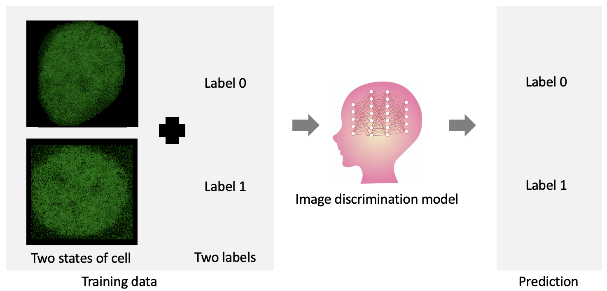
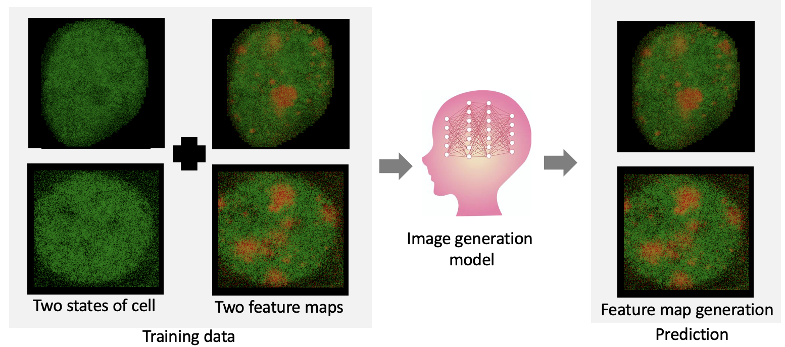
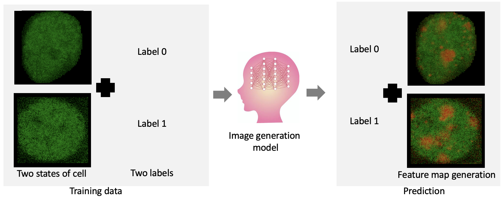

# Feactor (Feature detector)

* Computer Vision methods are successful in many tasks. 

  * We can training discrimination model if we know each image category, by using CNN based or ViT based.

    

  * We can train generation model if we know each target image, by using DCGAN based.

    

* Different with previous model, our aim is to obtain the important feature map with each category, by only know the category for each image.

  
